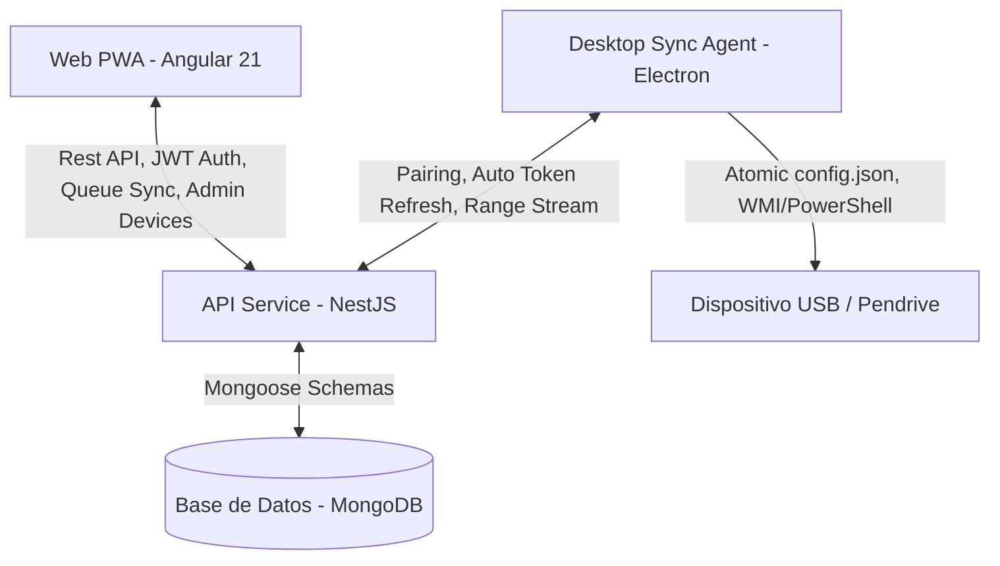

# 📚 Documentación Técnica de MyPodcast

Bienvenido a la documentación técnica oficial de **MyPodcast**, una plataforma integral para gestionar suscripciones de podcasts, sincronizar listas de reproducción bidireccionales y automatizar la transferencia de audios a dispositivos de almacenamiento USB para su reproducción sin conexión (ideal para coches y reproductores MP3 tradicionales).

El proyecto está estructurado como un **Monorepositorio gestionado con Nx**, lo que garantiza una excelente modularización, compilaciones ultrarrápidas y cohesión entre el frontend, el backend y la aplicación de escritorio.

---

## 🏗️ Arquitectura del Ecosistema

MyPodcast está compuesto por tres componentes principales:



1. **Frontend Web (PWA)** (`apps/web`):
   * Desarrollado en **Angular 21** con diseño moderno basado en **Vanilla CSS y tokens HSL** (Glassmorphism, gradientes suaves y layout responsivo optimizado para pantallas táctiles de vehículos Tesla, tablets y smartphones).
   * **Modo Tesla Integrado**:
     * Detección automática por User Agent y toggle manual de forzado almacenado en `localStorage`.
     * Bypass inteligente del Service Worker para peticiones de audio streaming en navegadores integrados de vehículos.
   * **Servicios Clave**:
     * `AudioPlayerService`: Gestión centralizada de reproductor HTML5, control de velocidad, peticiones de rango y persistencia del progreso de escucha.
     * `PlaylistService`: Gestión reactiva de la cola de reproducción del usuario (`signals`), sincronización con la API NestJS y reordenamiento interactivo.
     * `OfflineStorageService`: Almacenamiento local para escuchas sin conexión y soporte PWA.
   * **Módulos de la Aplicación (`apps/web/src/app/features`)**:
     * `/library`: Biblioteca principal de suscripciones y podcasts.
     * `/podcast-detail`: Listado detallado de episodios y búsqueda por palabra clave.
     * `/playlist`: Cola de reproducción sincronizada con controles de reordenación.
     * `/desktop-sync`: Panel de administración de dispositivos sincronizados USB, generación de códigos de 6 dígitos e inspección de espacio.
     * `/downloads`, `/history`, `/search`, `/users`: Descargas locales, historial de escucha, explorador RSS y gestión de usuarios (solo admin).
   * **Visualización de Versión**: Indicador discreto en el logo/subtexto de la barra de navegación (`NavbarComponent`) que muestra la versión activa (`v1.13.27-stable`).

2. **Backend API REST** (`apps/api`):
   * Desarrollado con **NestJS** y **Mongoose** (MongoDB).
   * Gestiona usuarios, suscripciones RSS (parsing dinámico con Cheerio/RSS Parser), biblioteca de episodios e historial.
   * **Módulo `LibraryModule` & `SyncConfig`**:
     * Gestiona las colas de sincronización por usuario (`SyncConfig.queue: Types.ObjectId[]`).
     * Auto-migración y deduplicación al iniciar para preservar tokens y evitar duplicados BSON.
     * Endpoints de vinculación dedicados (`pair/generate`, `pair/validate`, `pair/refresh`) que generan **tokens de escritorio independientes sin invalidar la sesión web del usuario**.
   * **Módulo `ProxyModule`**:
     * Streaming resiliente de audio desde fuentes externas (iVoox/RSS) soportando peticiones de rango HTTP (`Byte-Range` 206 Partial Content).
     * Soporta lectura de archivos previamente descargados en disco (`/downloads/:episodeId.mp3`).

3. **Agente de Escritorio (Desktop App)** (`apps/desktop-sync`):
   * Aplicación nativa en **Electron** que se ejecuta en segundo plano (System Tray) en Windows.
   * **Manejo Seguro de Configuración**: Escrituras atómicas a `config.json` mediante archivos temporales (`.tmp`) y `fs.renameSync` para prevenir corrupción de archivos por cierres inesperados.
   * **Auto-Renovación de Autorización**: Renueva automáticamente el token de acceso mediante `desktopRefreshToken` sin requerir re-vinculaciones por códigos de 6 dígitos.
   * **Manejo Inteligente de Errores**: Distingue entre errores de red/servidor (5xx/conexión) y token inválido (401/403). Solo desvincula en caso de revocación explícita.
   * **Auto-Update**: Integrado con `electron-updater` comprobando manifiestos `latest.yml` publicados automáticamente en GitHub Releases.

---

## 🔑 Variables de Entorno y Configuración

### Backend (`apps/api/.env.local`)
```env
PORT=3000
MONGODB_URI=mongodb://localhost:27017/mypodcast
JWT_SECRET=super-secret-key-change-in-production
JWT_REFRESH_SECRET=super-refresh-secret-key
FRONTEND_URL=http://localhost:4200
```

### Configuración Local del Agente de Escritorio (`config.json`)
Ubicado en el directorio de la aplicación de escritorio (`%APPDATA%/MyPodcastSync` o raíz local en portable):
```json
{
  "jwtToken": "eyJhbGciOi...",
  "desktopRefreshToken": "def123...",
  "desktopTokenExpires": "2026-09-10T12:00:00.000Z",
  "targetUsbSerial": "DF0C9B1B",
  "targetFolder": "Podcasts",
  "syncInterval": 60,
  "downloadSpeedLimit": 0
}
```

---

## ⚙️ Guía de Desarrollo y Ejecución

### 1. Base de Datos Local
```bash
docker-compose up -d
```

### 2. Ejecutar Aplicaciones (Modo Dev)
* **API Backend**: `npx nx serve api`
* **Web Frontend**: `npx nx serve web`
* **Agente de Escritorio**:
  ```bash
  npx nx build desktop-sync
  npx electron dist/apps/desktop-sync/main.js
  ```
  *(O ejecutar el script `Arrancar-Agente.bat` en Windows)*

### 3. Empaquetado y Releases
* **Desktop App**: `npx nx run desktop-sync:package` (ejecuta `package-prep.js` y `electron-builder` con la opción `-p always` para subir `latest.yml` a GitHub Releases).
* **Imágenes Docker**: Publicadas automáticamente a GitHub Container Registry (`ghcr.io/aremox/mypodcast-api:v*` y `ghcr.io/aremox/mypodcast-web:v*`).

---

## 📂 Estructura del Proyecto

```text
mypodcast/
├── CLAUDE.md                # Guía y cheat sheet para desarrollo y agentes de IA
├── DOCUMENTACION.md         # Documentación técnica oficial
├── README.md                # Presentación general e inicio rápido
├── apps/
│   ├── api/                 # API NestJS (Auth, Library, Podcasts, Episodes, Proxy)
│   ├── desktop-sync/        # Cliente de escritorio Electron (Main, Preload, Syncer, UI)
│   └── web/                 # Aplicación Web PWA Angular 21
├── docker-compose.yml       # Mongo local para desarrollo
├── docker-compose.portainer.yml # Despliegue en producción con imágenes GHCR
└── package.json             # Dependencias del proyecto y overrides de seguridad
```

## 📋 Matriz Completa de Capacidades y Requisitos Auditados

| Funcionalidad / Requisito | Módulo y Archivo Implementado | Detalle de Comportamiento y Código | Estado |
|---|---|---|---|
| **1. Búsqueda de Podcasts** | `ScraperService.searchPodcasts()` (`podcasts/scraper.service.ts`) & `SearchComponent` (`web/features/search`) | Realiza scraping en tiempo real de iVoox (`{query}_sw_1_1.html`), extrae portadas, autores y URLs de programas, permitiendo previsualizar y suscribirse en 1 clic. | ✅ Implementado |
| **2. Suscripción y Scrape Dinámico** | `PodcastsService.subscribe()` (`podcasts/podcasts.service.ts`) | Soporta URLs directas de iVoox o feeds RSS. Scrapea con Cheerio para resolver el feed XML oficial, descarga metadatos e inserta los episodios iniciales en MongoDB. | ✅ Implementado |
| **3. Auto-Añadido de Nuevos Episodios** | `CronService` (`podcasts/cron.service.ts`) & `PodcastsService.refreshFeed()` | Revisa los feeds RSS cada 30 min. Detecta episodios nuevos e invoca `LibraryService.addEpisodesToUserQueues()` para insertarlos **automáticamente** en la cola activa del usuario. | ✅ Implementado |
| **4. Filtros y Reglas Automatizadas en Cola** | `PlaylistComponent` (`web/features/playlist/playlist.component.ts`) & `PlaylistService` | Motor de 9 reglas configurables: priorizar episodios en progreso, auto-insertar episodios cortos (<X min), agrupar maratón por podcast, alternado round-robin, ordenar por duración o fecha cronológica. | ✅ Implementado |
| **5. Gestión de Reproducción & Progreso** | `AudioPlayerService` (`web/core/services/audio-player.service.ts`) | Reproductor HTML5 con control de velocidad (0.75x-2x), barra de progreso fluida, reanudación automática por minuto exacto y sincronización continua con el backend (`updateProgress`). | ✅ Implementado |
| **6. Auto-Eliminación al Finalizar** | `LibraryService.updateProgress()` (`library/library.service.ts`) | Al llegar al 100% o marcar un episodio como completado, el backend ejecuta `$pull` en la cola (`queue`) del usuario y registra la entrada en `PlayHistory`. | ✅ Implementado |
| **7. Histórico de Reproducción** | `LibraryService.getHistory()` (`library/library.service.ts`) & `/history` | Mantiene el registro cronológico completo de episodios escuchados (`PlayHistory`), progreso porcentual y fecha de última reproducción con paginación. | ✅ Implementado |
| **8. Modo Tesla Integrado** | `AudioPlayerService` & `app.config.ts` | Detecta navegadores integrados de vehículos Tesla, ajusta el buffer de reproducción, omite interceptores rígidos de Service Worker y adapta la interfaz a pantallas táctiles de gran tamaño. | ✅ Implementado |
| **9. Vinculación Persistente de Escritorio** | `LibraryService.generateDesktopTokens()` & `main.ts` | Emisión de `desktopRefreshToken` a 30 días con renovación silenciosa de accesos cada 60s sin requerir volver a ingresar el PIN de 6 cifras. | ✅ Implementado |
| **10. Sincronización Física USB** | `syncer.ts` (`apps/desktop-sync/src/syncer.ts`) | Escanea pendrives USB vía PowerShell, descarga episodios en paralelo con límites de velocidad opcionales, limpia episodios leídos y renombra con índices (`1. Titulo.mp3`). | ✅ Implementado |
