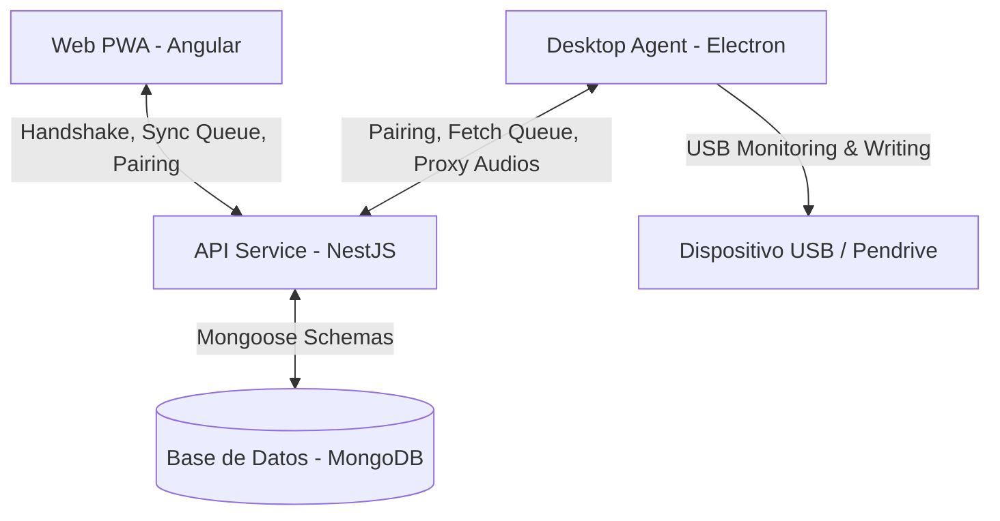

# 📚 Documentación Técnica de MyPodcast

Bienvenido a la documentación técnica oficial de **MyPodcast**, una plataforma integral y moderna para gestionar suscripciones de podcasts, sincronizar listas de reproducción bidireccionales y automatizar la transferencia de audios a dispositivos de almacenamiento USB para su reproducción sin conexión (ideal para coches y reproductores MP3 tradicionales).

El proyecto está estructurado como un **Monorepositorio gestionado con Nx**, lo que garantiza una excelente modularización, compilaciones ultrarrápidas y cohesión entre el frontend, el backend y la aplicación de escritorio.

---

## 🏗️ Arquitectura del Ecosistema

MyPodcast está compuesto por tres componentes principales:



1.  **Frontend Web (PWA)** (`apps/web`):
    *   Construido en **Angular 21** con diseño moderno (Glassmorphism, gradientes de color HSL y CSS responsivo).
    *   Funciona como una Aplicación Web Progresiva (PWA) con Service Workers para instalación en móviles y ordenadores.
    *   Permite a los usuarios gestionar su biblioteca, suscribirse a podcasts RSS, reordenar su cola de reproducción activa y generar códigos de vinculación de 6 dígitos.
2.  **Backend API REST** (`apps/api`):
    *   Desarrollado con **NestJS** y **Mongoose** (MongoDB).
    *   Gestiona la persistencia de usuarios, subscripciones, episodios, logs de sincronización y tokens de vinculación por dispositivo.
    *   Servicio proxy de audio integrado para descargar episodios superando las restricciones CORS y de compresión en caliente.
3.  **Agente de Escritorio (Desktop App)** (`apps/desktop-sync`):
    *   Aplicación nativa en **Electron** que se ejecuta en segundo plano (System Tray) en la máquina del usuario.
    *   **USB Scanner**: Utiliza scripts de PowerShell no perfiles (`Win32_LogicalDisk`) para escanear unidades conectadas en tiempo real y emparejarlas por su número de serie (`VolumeSerialNumber`).
    *   **Sync Engine**: Descarga los episodios faltantes en paralelo, renombra los archivos de audio con numeración indexada (ej. `1. Titulo.mp3`) para preservar el orden en los reproductores de coches, y elimina automáticamente los archivos antiguos eliminados de la cola web.

---

## 🔑 Variables de Entorno y Configuración

El backend NestJS (`apps/api`) requiere un archivo `.env.local` en la raíz del proyecto para funcionar.

### Ejemplo de `.env.local`
```env
PORT=3000
MONGODB_URI=mongodb://localhost:27017/mypodcast
JWT_SECRET=super-secret-key-change-in-production
```

### Configuración del Agente (`config.json`)
El agente de escritorio guarda su estado local en un archivo `config.json` en la raíz de su directorio de trabajo:
```json
{
  "jwtToken": "eyJhbGciOi...",
  "targetUsbSerial": "DF0C9B1B",
  "targetFolder": "Podcasts",
  "syncInterval": 900
}
```

---

## ⚙️ Guía de Desarrollo y Ejecución

Al ser un repositorio Nx, todas las tareas se ejecutan usando comandos de línea de comandos unificados.

### 🔌 Requisitos Previos
1.  **Node.js**: Versión v20 o superior.
2.  **Docker & Docker Compose**: Para arrancar la base de datos de MongoDB.

### 1. Iniciar Base de Datos Local
Arranca la instancia de MongoDB local utilizando docker-compose:
```bash
docker-compose up -d
```

### 2. Ejecutar Aplicaciones en Modo Desarrollo (Serve)

*   **API Backend**:
    ```bash
    npx nx serve api
    ```
*   **Web Frontend**:
    ```bash
    npx nx serve web
    ```
*   **Agente de Escritorio (Electron)**:
    ```bash
    # Primero compila los archivos estáticos
    npx nx build desktop-sync
    # Lanza Electron
    npx electron dist/apps/desktop-sync/main.js
    ```
    *Nota: También puedes usar el archivo interactivo creado para Windows: `Arrancar-Agente.bat`.*

---

## 📂 Estructura de Directorios

```text
mypodcast/
├── apps/
│   ├── api/                 # API NestJS (Base de Datos, Rutas RSS, Proxy)
│   ├── desktop-sync/        # Aplicación nativa de escritorio Electron
│   │   └── src/
│   │       ├── assets/      # Interfaz HTML/CSS/JS (Renderer) y recursos
│   │       ├── main.ts      # Proceso principal de Electron (Main Process)
│   │       ├── preload.ts   # Script puente de seguridad (Preload)
│   │       ├── usb-scanner  # Módulo escáner de discos lógicos Win32
│   │       └── syncer       # Lógica core de sincronización y descarga
│   └── web/                 # Frontend PWA en Angular 21
├── dist/                    # Directorio de compilaciones finales
├── libs/                    # Módulos y librerías compartidas (Nx)
├── docker-compose.yml       # Orquestador de MongoDB y bases de desarrollo
├── Arrancar-Agente.bat      # Script automatizado de compilación y arranque
└── package.json             # Dependencias del proyecto
```

---

## 🔄 Flujo Detallado de Sincronización USB

El proceso de sincronización ejecutado por la clase `Syncer` del agente funciona de la siguiente manera:

1.  **Escaneo**: `UsbScanner` comprueba las unidades conectadas cada 10 segundos buscando el serial (`VolumeSerialNumber`) guardado en la cuenta vinculada.
2.  **Solicitud**: Se realiza una consulta HTTP GET a `/api/library/sync-config` adjuntando el token JWT.
3.  **Análisis de la Cola**:
    -   Se compara la lista de reproducción remota (`queue`) con los archivos `.mp3` físicos en el USB.
    -   Los archivos en el USB que **no** estén en la cola remota se eliminan automáticamente para liberar espacio.
4.  **Descarga**:
    -   Se descargan en bucle los episodios faltantes a través del endpoint `/api/proxy/audio/:episodeId`.
    -   Cada archivo se guarda con su índice posicional pre-fijado (`[índice]. [título].mp3`) asegurando que los reproductores de coches que ordenan alfabéticamente reproduzcan la lista en el orden exacto definido por el usuario en la interfaz web.
