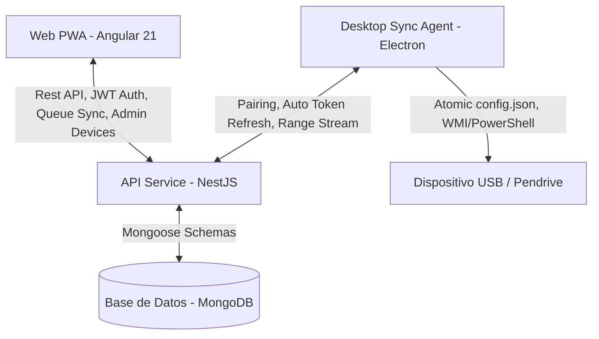

# 📚 Documentación Técnica de MyPodcast

Bienvenido a la documentación técnica oficial de **MyPodcast**, una plataforma integral para gestionar suscripciones de podcasts, sincronizar listas de reproducción bidireccionales y automatizar la transferencia de audios a dispositivos de almacenamiento USB para su reproducción sin conexión (ideal para coches y reproductores MP3 tradicionales).

El proyecto está estructurado como un **Monorepositorio gestionado con Nx**, lo que garantiza una excelente modularización, compilaciones ultrarrápidas y cohesión entre el frontend, el backend y la aplicación de escritorio.

---

## 🏗️ Arquitectura del Ecosistema

MyPodcast está compuesto por tres componentes principales:



1. **Frontend Web (PWA)** (`apps/web`):
   * Desarrollado en **Angular 21** con diseño moderno basado en **Vanilla CSS y tokens HSL** (Glassmorphism, gradientes suaves y layout responsivo optimizado para pantallas táctiles de vehículos Tesla, tablets y smartphones).
   * **Modo Tesla Integrado**:
     * Detección automática por User Agent y toggle manual de forzado almacenado en `localStorage`.
     * Bypass inteligente del Service Worker para peticiones de audio streaming en navegadores integrados de vehículos.
   * **Servicios Clave**:
     * `AudioPlayerService`: Gestión centralizada de reproductor HTML5, control de velocidad, peticiones de rango y persistencia del progreso de escucha.
     * `PlaylistService`: Gestión reactiva de la cola de reproducción del usuario (`signals`), sincronización con la API NestJS y reordenamiento interactivo.
     * `OfflineStorageService`: Almacenamiento local para escuchas sin conexión y soporte PWA.
   * **Módulos de la Aplicación (`apps/web/src/app/features`)**:
     * `/library`: Biblioteca principal de suscripciones y podcasts.
     * `/podcast-detail`: Listado detallado de episodios y búsqueda por palabra clave.
     * `/playlist`: Cola de reproducción sincronizada con controles de reordenación.
     * `/desktop-sync`: Panel de administración de dispositivos sincronizados USB, generación de códigos de 6 dígitos e inspección de espacio.
     * `/downloads`, `/history`, `/search`, `/users`: Descargas locales, historial de escucha, explorador RSS y gestión de usuarios (solo admin).
   * **Visualización de Versión**: Indicador discreto en el logo/subtexto de la barra de navegación (`NavbarComponent`) que muestra la versión activa (`v1.13.27-stable`).

2. **Backend API REST** (`apps/api`):
   * Desarrollado con **NestJS** y **Mongoose** (MongoDB).
   * Gestiona usuarios, suscripciones RSS (parsing dinámico con Cheerio/RSS Parser), biblioteca de episodios e historial.
   * **Módulo `LibraryModule` & `SyncConfig`**:
     * Gestiona las colas de sincronización por usuario (`SyncConfig.queue: Types.ObjectId[]`).
     * Auto-migración y deduplicación al iniciar para preservar tokens y evitar duplicados BSON.
     * Endpoints de vinculación dedicados (`pair/generate`, `pair/validate`, `pair/refresh`) que generan **tokens de escritorio independientes sin invalidar la sesión web del usuario**.
   * **Módulo `ProxyModule`**:
     * Streaming resiliente de audio desde fuentes externas (iVoox/RSS) soportando peticiones de rango HTTP (`Byte-Range` 206 Partial Content).
     * Soporta lectura de archivos previamente descargados en disco (`/downloads/:episodeId.mp3`).

3. **Agente de Escritorio (Desktop App)** (`apps/desktop-sync`):
   * Aplicación nativa en **Electron** que se ejecuta en segundo plano (System Tray) en Windows.
   * **Manejo Seguro de Configuración**: Escrituras atómicas a `config.json` mediante archivos temporales (`.tmp`) y `fs.renameSync` para prevenir corrupción de archivos por cierres inesperados.
   * **Auto-Renovación de Autorización**: Renueva automáticamente el token de acceso mediante `desktopRefreshToken` sin requerir re-vinculaciones por códigos de 6 dígitos.
   * **Manejo Inteligente de Errores**: Distingue entre errores de red/servidor (5xx/conexión) y token inválido (401/403). Solo desvincula en caso de revocación explícita.
   * **Auto-Update**: Integrado con `electron-updater` comprobando manifiestos `latest.yml` publicados automáticamente en GitHub Releases.

---

## 🔑 Variables de Entorno y Configuración

### Backend (`apps/api/.env.local`)
```env
PORT=3000
MONGODB_URI=mongodb://localhost:27017/mypodcast
JWT_SECRET=super-secret-key-change-in-production
JWT_REFRESH_SECRET=super-refresh-secret-key
FRONTEND_URL=http://localhost:4200
```

### Configuración Local del Agente de Escritorio (`config.json`)
Ubicado en el directorio de la aplicación de escritorio (`%APPDATA%/MyPodcastSync` o raíz local en portable):
```json
{
  "jwtToken": "eyJhbGciOi...",
  "desktopRefreshToken": "def123...",
  "desktopTokenExpires": "2026-09-10T12:00:00.000Z",
  "targetUsbSerial": "DF0C9B1B",
  "targetFolder": "Podcasts",
  "syncInterval": 60,
  "downloadSpeedLimit": 0
}
```

---

## ⚙️ Guía de Desarrollo y Ejecución

### 1. Base de Datos Local
```bash
docker-compose up -d
```

### 2. Ejecutar Aplicaciones (Modo Dev)
* **API Backend**: `npx nx serve api`
* **Web Frontend**: `npx nx serve web`
* **Agente de Escritorio**:
  ```bash
  npx nx build desktop-sync
  npx electron dist/apps/desktop-sync/main.js
  ```
  *(O ejecutar el script `Arrancar-Agente.bat` en Windows)*

### 3. Empaquetado y Releases
* **Desktop App**: `npx nx run desktop-sync:package` (ejecuta `package-prep.js` y `electron-builder` con la opción `-p always` para subir `latest.yml` a GitHub Releases).
* **Imágenes Docker**: Publicadas automáticamente a GitHub Container Registry (`ghcr.io/aremox/mypodcast-api:v*` y `ghcr.io/aremox/mypodcast-web:v*`).

---

## 📂 Estructura del Proyecto

```text
mypodcast/
├── CLAUDE.md                # Guía y cheat sheet para desarrollo y agentes de IA
├── DOCUMENTACION.md         # Documentación técnica oficial
├── README.md                # Presentación general e inicio rápido
├── apps/
│   ├── api/                 # API NestJS (Auth, Library, Podcasts, Episodes, Proxy)
│   ├── desktop-sync/        # Cliente de escritorio Electron (Main, Preload, Syncer, UI)
│   └── web/                 # Aplicación Web PWA Angular 21
├── docker-compose.yml       # Mongo local para desarrollo
├── docker-compose.portainer.yml # Despliegue en producción con imágenes GHCR
└── package.json             # Dependencias del proyecto y overrides de seguridad
```

## 📋 Matriz de Verificación de Requisitos Funcionales

| Requisito Funcional | Implementación en Código | Estado |
|---|---|---|
| **1. Vinculación Persistente de Escritorio** | `LibraryService.generateDesktopTokens()` en API genera `desktopRefreshToken` a 30 días. `main.ts` en Electron renueva automáticamente sin pedir PIN de 6 cifras. | ✅ Cumplido |
| **2. Protección de Sesión Web** | `LibraryController.validatePairingCode()` utiliza `authService.getUserById()` evitando la rotación del token web. | ✅ Cumplido |
| **3. Resiliencia de Desvinculación** | `main.ts` de Electron maneja respuestas `'NETWORK_ERROR'` y `'SERVER_ERROR'` reintentando en el siguiente ciclo sin limpiar `jwtToken`. | ✅ Cumplido |
| **4. Integridad BSON y Deduplicación** | `LibraryService.onModuleInit()` migra y consolida `SyncConfig` duplicados preservando tokens de dispositivos activos. | ✅ Cumplido |
| **5. Sincronización Automática USB** | `syncer.ts` realiza ordenación por índice (`1. Titulo.mp3`), elimina episodios quitados de la cola y renombra existentes si cambia la posición. | ✅ Cumplido |
| **6. Streaming y Proxy de Audio** | `ProxyController.streamAudio()` soporta peticiones HTTP `Range` (206 Partial Content) e iVoox URLs sanitizadas. | ✅ Cumplido |
| **7. Notificaciones Interactivas Windows** | `syncer.ts` genera notificaciones Toast con acciones nativas "Abrir Carpeta" y "Reproducir". | ✅ Cumplido |
| **8. Despliegue y Auto-Updates** | `electron-builder` empaqueta con `-p always` publicando ejecutable e instalador junto al manifiesto `latest.yml` en GitHub Releases. | ✅ Cumplido |
| **9. Visualización de Versión en UI** | `NavbarComponent` (Web) e `index.html` (Desktop) muestran dinámicamente la versión (`v1.13.27-stable`). | ✅ Cumplido |
| **10. Limpieza de Vulnerabilidades** | `package.json` incluye overrides explícitos para `axios`, `mongoose`, `tar`, `brace-expansion`, `body-parser`, `adm-zip`, `tmp` y `undici`. | ✅ Cumplido |
