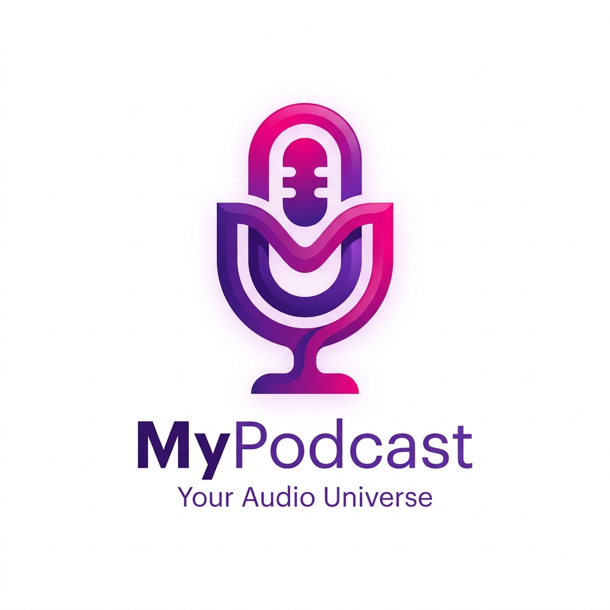

# 🎧 MyPodcast

<p align="center">
  
</p>

**MyPodcast** es un ecosistema completo para suscripciones de podcasts, listas de reproducción bidireccionales y **sincronización automática de episodios a dispositivos USB** para reproducción offline en coches y reproductores MP3.

---

## ✨ Características Principales

- 📱 **Web PWA (Angular 21)**: Interfaz responsiva con soporte PWA, reproductor de audio integrado, streaming resiliente con peticiones de rango y control multi-dispositivo.
- ⚙️ **Backend API (NestJS & Mongoose)**: Autenticación JWT, gestión de cola sincronizada (`SyncConfig`), auto-migración de datos y servidor proxy de audio iVoox/RSS.
- 💻 **Desktop Sync Agent (Electron)**: Cliente nativo en segundo plano con escáner automático de pendrives por número de serie de volumen (`VolumeSerialNumber`), descargas paralelas indexadas, escrituras atómicas de configuración y auto-renovación de tokens.
- 🐳 **Despliegue Docker & CI/CD**: Compilaciones automatizadas en GitHub Actions, generación de instaladores `.exe` con manifiesto de actualización `latest.yml` y contenedores listos para Portainer (`ghcr.io`).

---

## 🚀 Inicio Rápido (Desarrollo)

### 1. Iniciar MongoDB Local
```bash
docker-compose up -d
```

### 2. Backend (NestJS)
```bash
npx nx serve api
```

### 3. Frontend Web (Angular 21)
```bash
npx nx serve web
```

### 4. Agente de Escritorio (Electron)
En Windows: ejecutar **`Arrancar-Agente.bat`** o ejecutar por comandos:
```bash
npx nx build desktop-sync
npx electron dist/apps/desktop-sync/main.js
```

---

## 📚 Documentación

- 📄 **[CLAUDE.md](file:///d:/Programacion/IA/mypodcast/CLAUDE.md)**: Guía de comandos rápidos, convenciones y reglas para agentes de IA.
- 📖 **[DOCUMENTACION.md](file:///d:/Programacion/IA/mypodcast/DOCUMENTACION.md)**: Documentación técnica detallada de la arquitectura, variables de entorno y esquemas.

---

## 🛠️ Tecnologías Empleadas

* **Monorepository**: [Nx](https://nx.dev)
* **Frontend**: Angular 21 (Vanilla CSS + HSL Design System, PWA Service Workers)
* **Backend**: NestJS, Mongoose (MongoDB), Axios, Cheerio, RSS Parser
* **Desktop App**: Electron, PowerShell Disk Scanner, `electron-builder`

